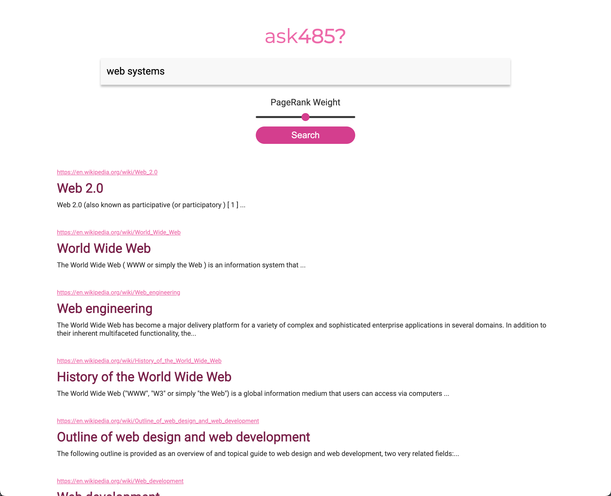

# Search Engine Project

## Disclaimer
This repo is just a display of a course project for EECS 485 Web Systems @ University of Michigan. I'm excluding the code to comply with academic integrity policies.

## Technologies Used
- **Frontend**: Jinja2, HTML, CSS
- **Backend**: Python Flask, SQLite
- **Data Processing**: MapReduce, Beautiful Soup
- **Architecture**: Service-Oriented Architecture (SOA) 
- **Deployment**: AWS (EC2)

## Project Overview
Scalable search engine implementation featuring:
- **Information retrieval** using tf-idf text analysis  
- **PageRank algorithm** for link analysis  
- **MapReduce** implementation for parallel data processing  
- **Service-Oriented Architecture** with multiple backend servers  
- **REST API endpoints** for search functionality  
- **Dynamic web interface** for search results  

## System Architecture
### MapReduce Pipeline
- Processes HTML documents using MapReduce jobs  
- Generates segmented inverted index  
- Implements document cleaning and text analysis  
- Calculates tf-idf scores and document normalization  

### Index Server
- REST API serving search results in JSON format  
- Handles multiple inverted index segments  
- Integrates PageRank scoring  
- Provides weighted document scoring  

### Search Server
- User-facing web interface  
- Server-side rendering with Jinja2  
- Aggregates results from index servers  
- Provides clean search interface   

## Code Tree

<pre>
├── bin
│   ├── index
│   ├── install
│   ├── search
│   └── searchdb
├── index_server
│   ├── index
│   │   ├── __init__.py
│   │   ├── api
│   │   │   ├── __init__.py
│   │   │   └── main.py
│   │   ├── inverted_index
│   │   │   ├── inverted_index_0.txt
│   │   │   ├── inverted_index_1.txt
│   │   │   └── inverted_index_2.txt
│   │   ├── pagerank.out
│   │   └── stopwords.txt
│   └── pyproject.toml
├── inverted_index
│   ├── crawl.tar.xz
│   ├── example_crawl
│   │   ├── 44664014.html
│   │   ├── 67613335.html
│   │   └── 78661573.html
│   ├── example_output
│   │   ├── part-00000
│   │   └── part-00001
│   ├── crawl
│   │   ├── 00035015.html
│   │   ├── 00051163.html
│   │   └── ... (couple thousand files)
│   ├── map0.py
│   ├── map1.py
│   ├── map2.py
│   ├── map3.py
│   ├── map4.py
│   ├── map5.py
│   ├── pipeline.sh
│   ├── pylintrc
│   ├── reduce0.py
│   ├── reduce1.py
│   ├── reduce2.py
│   ├── reduce3.py
│   ├── reduce4.py
│   ├── reduce5.py
│   ├── partition.py
│   └── stopwords.txt
├── requirements.txt
├── search_server
│   ├── pyproject.toml
│   └── search
│       ├── __init__.py
│       ├── config.py
│       ├── model.py
│       ├── static
│       │   └── css
│       │       └── style.css
│       ├── templates
│       │   └── index.html
│       └── views
│           ├── __init__.py
│           └── search.py
├── tests
│   ├── conftest.py
│   ├── test_index_server_public.py
│   ├── test_pipeline_public.py
│   ├── test_scripts.py
│   ├── test_search_server_public.py
│   ├── test_style.py
│   ├── test_submission_files.py
│   ├── testdata
│   │   ├── search.sqlite3
│   │   ├── small.sql
│   │   ├── test_doc_count_one_mapper
│   │   │   └── crawl
│   │   │       └── concat.html
│   │   ├── test_pipeline03
│   │   │   ├── crawl
│   │   │   │   ├── 5001087.html
│   │   │   │   └── 7406841.html
│   │   │   └── expected.txt
│   │   ├── test_pipeline04
│   │   │   ├── crawl
│   │   │   │   ├── 4713413.html
│   │   │   │   └── 5297847.html
│   │   │   └── expected.txt
│   │   ├── test_pipeline05
│   │   │   ├── crawl
│   │   │   │   ├── 34368.html
│   │   │   │   └── 8705759.html
│   │   │   └── expected.txt
│   │   ├── test_pipeline06
│   │   │   ├── crawl
│   │   │   │   ├── 2911536.html
│   │   │   │   └── 3799809.html
│   │   │   └── expected.txt
│   │   ├── test_pipeline10
│   │   │   ├── crawl
│   │   │   │   ├── 2911536.html
│   │   │   │   ├── 527080.html
│   │   │   │   └── 9196119.html
│   │   │   └── expected
│   │   │       ├── part-0.txt
│   │   │       └── part-1.txt
│   │   ├── test_pipeline14
│   │   │   ├── crawl
│   │   │   │   ├── 1244087.html
│   │   │   │   ├── 2574313.html
│   │   │   │   ├── 2911536.html
│   │   │   │   ├── 3251638.html
│   │   │   │   ├── 3411119.html
│   │   │   │   ├── 565642.html
│   │   │   │   ├── 742869.html
│   │   │   │   ├── 8507994.html
│   │   │   │   ├── 8955181.html
│   │   │   │   └── 9196119.html
│   │   │   └── expected
│   │   │       ├── part-0.txt
│   │   │       ├── part-1.txt
│   │   │       └── part-2.txt
│   │   ├── test_pipeline15
│   │   │   ├── part-00000
│   │   │   ├── part-00001
│   │   │   └── part-00002
│   │   └── test_pipeline16
│   │       ├── crawl
│   │       │   ├── 4436465.html
│   │       │   ├── 739261.html
│   │       │   └── 9229752.html
│   │       └── expected
│   │           ├── part-00000
│   │           ├── part-00001
│   │           └── part-00002
│   └── utils
│       ├── __init__.py
│       ├── inverted_index.py
│       ├── pipeline.py
│       └── processes.py
└── var
    ├── log
    │   ├── index.log
    │   └── search.log
    └── search.sqlite3
</pre>
